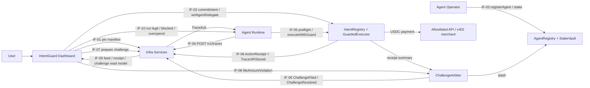
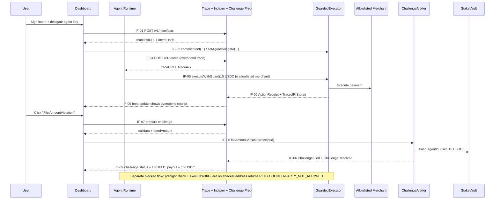

# 1. Executive Summary

IntentGuard is a guard-and-recourse layer for AI agents that move USDC on EVM chains. The hackathon MVP is intentionally narrow: one Base Sepolia ERC-4337 executor module, one intent schema, one deterministic challenge type (`AmountViolation`), one slash path, one trusted reviewer key stub, one Gemini-powered reviewer copilot for non-authoritative incident summaries, one MongoDB Atlas-backed evidence store, and one scripted USDC payment agent with legitimate and malicious runs.

The product problem is simple: once an agent can spend stablecoins, identity and payment rails are not enough. A valid agent can still be tricked by prompt injection or drift into actions the user did not approve. The missing primitive is not “can the agent pay,” but “did this payment match a user-approved intent, and what happens if it did not.”

The MVP solution combines:

* hard pre-execution checks for the things that are cheap and deterministic to enforce in a hackathon build: delegated agent key, USDC-only token, counterparty allowlist, expiry, day-cap, and trace availability attestation;
* cryptographic action receipts that commit to calldata and a hashed decision trace;
* one deterministic post-execution recourse path: if the executed amount exceeds the intent’s per-tx cap, the user can file `AmountViolation` and slash the operator’s stake;
* a MongoDB Atlas-backed off-chain evidence layer for manifests, traces, indexed receipts, challenges, and reviewer metadata;
* a Gemini API reviewer copilot that explains stored traces and receipts to humans without affecting the deterministic slash path.

Why now:

* agent-paid USDC flows are real enough to demo now;
* tool-use standards like MCP increase the prompt-injection surface;
* embedded wallets and smart accounts make delegated agent spending easy to ship;
* the stablecoin use case gives clean dollar-denominated loss and compensation math.

Who this is for:

* **Primary:** developers shipping autonomous USDC agents who need guardrails before letting users connect funds.
* **Secondary:** users delegating a smart account to an agent and wanting visible constraints plus a recourse path.
* **Stretch:** enterprises that want audit trails and later semantic review.

Demo-day end state:

1. User onboards with an embedded wallet and deploys a Base Sepolia smart account with `GuardedExecutor`.
2. User signs and commits an intent: **10 USDC max per tx, 50 USDC max per day, 3 allowlisted counterparties, USDC only**.
3. User delegates an agent key to Agent X.
4. Agent X pays an allowlisted API endpoint **2 USDC**; receipt appears on-chain and in the dashboard.
5. A malicious prompt tries to send **20 USDC** to a non-allowlisted attacker; the guard rejects it with a deterministic reason code.
6. A second malicious prompt sends **15 USDC** to an allowlisted counterparty; the payment executes, receipt appears, and the user files `AmountViolation`.
7. `ChallengeArbiter` proves the amount exceeded the manifest cap, slashes the operator stake in `StakeVault`, and transfers **15 USDC** back to the user.

---

# 2. Success Criteria & Non-Goals

## 2.1 Demo-day pass/fail bar

### Shared demo constants

| Item                       | Value                                     |
| -------------------------- | ----------------------------------------- |
| Chain                      | Base Sepolia                              |
| Token                      | USDC test token (`USDC_ADDRESS` from env) |
| Intent per-tx cap          | 10 USDC (`10_000_000`)                    |
| Intent per-day cap         | 50 USDC (`50_000_000`)                    |
| Allowlisted counterparties | 3 addresses                               |
| Agent stake                | 50 USDC                                   |
| Challenge bond             | 1 USDC                                    |
| Legitimate payment         | 2 USDC                                    |
| Blocked malicious payment  | 20 USDC to attacker address               |
| Challenged overspend       | 15 USDC to allowlisted address            |
| Challenge type             | `AmountViolation` only                    |
| Protocol fee               | 0 for MVP                                 |

### MVP policy decisions

| Dimension                         | MVP decision                                                                                                  |
| --------------------------------- | ------------------------------------------------------------------------------------------------------------- |
| Executor behavior                 | `GREEN` and `RED` only; `YELLOW` exists in interfaces but is not implemented in flow                          |
| Hard pre-exec checks              | delegated key, token == USDC, target in allowlist, intent not expired, day-cap not exceeded, valid `TraceAck` |
| Post-exec deterministic challenge | `receipt.amount > intent.maxSpendPerTx`                                                                       |
| Semantic review                   | reviewer signer stub remains authoritative; Gemini is assistive only and not in the live slash path          |
| Challenge filing                  | user clicks in dashboard; infra prepares calldata; wallet sends on-chain tx                                   |
| Off-chain evidence store          | MongoDB Atlas stores manifests, traces, indexed receipts, challenges, and reviewer summaries                  |
| Stablecoin scope                  | USDC only                                                                                                     |

### Pass

The build passes only if all of the following happen on Base Sepolia during one live run:

1. Intent commit succeeds from the dashboard and is visible on-chain.
2. Agent delegation succeeds from the dashboard.
3. Legitimate 2 USDC payment succeeds through `GuardedExecutor`.
4. An `ActionReceipt` and trace URI are indexed and displayed in the feed.
5. Non-allowlisted attack is rejected with reason `COUNTERPARTY_NOT_ALLOWED` and shown in the UI.
6. Allowlisted 15 USDC overspend executes and appears in the feed.
7. User files `AmountViolation`; the challenge resolves on-chain in the same demo session.
8. User balance increases by 15 USDC from `StakeVault`.
9. No step requires manual contract writes, manual DB edits, or ad hoc script changes.

### Fail

Any of the following is a fail:

* local chain only;
* blocked attack shown only as a screenshot, not a live result;
* slash result not visible on-chain;
* receipts/challenges require Etherscan instead of the product UI;
* team must redeploy or patch interfaces mid-demo.

## 2.2 Definition of done

The MVP is done when all of these are true:

* Contract ABIs and deployed addresses are published in one source-of-truth file and consumed by all other workstreams.
* One canonical manifest schema and one canonical `DecisionTrace v1` schema are frozen by hour 12.
* `GuardedExecutor` accepts a valid live execution path and rejects a non-allowlisted path with a deterministic reason code.
* `ActionReceipt` data is both emitted as events and stored on-chain in a challengeable receipt mapping.
* The trace service returns a signed `TraceAck` and the guard verifies it on-chain.
* Off-chain evidence for manifests, traces, indexed receipts, and challenges is persisted in MongoDB Atlas.
* The frontend can commit an intent, delegate the agent key, trigger the three demo runs, view receipts, and file a challenge.
* The `/review` flow can load stored evidence and render a Gemini-generated incident summary that never changes the deterministic `AmountViolation` outcome.
* `ChallengeArbiter.fileAmountViolation(receiptId)` deterministically slashes stake and pays the user.
* One runbook lets any teammate run the demo from a fresh browser session.

## 2.3 Non-goals

These are explicitly out of scope for the hackathon build:

* any second chain;
* any second executor;
* any token other than USDC;
* weekly spend caps;
* action bitfields;
* geofencing;
* blacklist registries;
* generalized calldata parsing for arbitrary DeFi routers;
* TEE attestation;
* zkML or new cryptographic proof systems;
* AVS / EigenLayer / restaking wiring;
* multi-verifier committees in live flow;
* semantic challenge types in live flow;
* reputation SBTs;
* production insurance pool accounting;
* production-grade unbonding UI;
* push notifications / 2FA / `YELLOW` approval path.

---

# 3. System Architecture



## 3.1 Layer ownership map

Layer ownership here means canonical implementation owner of the named architecture component.

| Layer | Component                                | Owner                     |
| ----- | ---------------------------------------- | ------------------------- |
| 1     | `IntentRegistry`                         | Protocol Engineer         |
| 2     | `AgentRegistry`                          | Protocol Engineer         |
| 3     | `GuardedExecutor`                        | Protocol Engineer         |
| 4     | `ActionReceipts` + off-chain trace store | Verifier & Infra Engineer |
| 5     | `ChallengeArbiter`                       | Protocol Engineer         |
| 6     | `StakeVault`                             | Protocol Engineer         |

## 3.2 Layer walkthrough

### Layer 1 — Intent Layer: `IntentRegistry`

`IntentRegistry` stores the enforceable subset of the user’s intent on-chain and keeps the full JSON manifest on IPFS.

Hackathon implementation:

* Frontend creates canonical manifest JSON and sends it to infra for pinning.
* Infra returns `manifestURI` and `intentHash = keccak256(canonicalManifestJson)`.
* Frontend calls `commitIntent(intentHash, cfg, manifestURI)`.
* Contract stores:

  * `activeIntentHash[owner] = intentHash`
  * `intentByHash[intentHash] = IntentConfig + manifestURI`
* Revocation sets `activeIntentHash[owner] = bytes32(0)` but historical entries remain for dispute replay.

MVP fields on-chain:

* `owner`
* `token` (single USDC address, not an array)
* `maxSpendPerTx`
* `maxSpendPerDay`
* `allowedCounterparties`
* `expiry`
* `nonce`

Notes:

* `allowedCounterparties` is small and bounded; code may cap length at 8, demo uses 3.
* Day cap uses a UTC day bucket (`block.timestamp / 1 days`) rather than rolling 24h.

### Layer 2 — Agent Identity Layer: `AgentRegistry`

`AgentRegistry` maps `agentId` to operator metadata and current stake state.

Hackathon implementation:

* `registerAgent(agentId, operator, metadataURI)`
* `stake(agentId, amount)` after USDC approval to `StakeVault`
* `getAgent(agentId)` returns operator, stake, tier, reputation

MVP behavior:

* Bronze tier only matters in practice.
* Challenge window for Bronze defaults to 72 hours.
* Reputation changes only on dispute outcomes; no SBT and no external scoring.

### Layer 3 — Execution Layer: `GuardedExecutor`

`GuardedExecutor` is the mandatory module/hook on the user’s Base Sepolia smart account. The runtime must go through this module for every agent-initiated payment.

MVP hard checks:

* agent delegate key is approved for the user + `agentId`
* token is USDC
* target is in `allowedCounterparties`
* current time < `expiry`
* `spentToday + amount <= maxSpendPerDay`
* `TraceAck` signature is valid and not expired

MVP live behavior:

* `GREEN`: execute and emit receipt
* `RED`: revert with custom error `GuardRejected(bytes32 reasonCode)`
* `YELLOW`: reserved in enum only; not wired

Important hackathon choice:

* `maxSpendPerTx` is **not** hard-blocked in `executeWithGuard` for the live demo.
* It is recorded and enforced by post-execution deterministic challenge.
* This is the deliberate compromise that lets the demo show both prevention (blocked bad counterparty) and recourse (successful overspend + slash) in one 5-minute flow.

Blocked attempts:

* Because reverts do not emit logs, the runtime calls `preflightCheck()` before the scripted blocked attack.
* The dashboard reads the blocked reason from the runtime demo status API.

### Layer 4 — Evidence Layer: `ActionReceipts` + off-chain trace store

The runtime serializes `DecisionTrace v1`, computes `contextDigest = keccak256(canonicalTraceJson)`, uploads the full trace, receives a signed `TraceAck`, and includes both in `executeWithGuard`.

MongoDB Atlas is the off-chain system of record for:

* pinned manifest metadata;
* trace metadata and cached trace payloads;
* indexed receipts and challenges;
* reviewer-facing incident summaries and replay metadata.

On successful execution:

* `GuardedExecutor` stores a `ReceiptSummary` mapping keyed by `receiptId`
* emits the required `ActionReceipt`
* emits companion metadata events for `receiptId` and `traceURI`

`ReceiptSummary` must include at minimum:

* `owner`
* `agentId`
* `intentHash`
* `target`
* `token`
* `amount`
* `callDataHash`
* `contextDigest`
* `nonce`
* `timestamp`

Why the on-chain mapping matters:

* contracts cannot read historical events;
* `ChallengeArbiter` needs on-chain access to receipt data.

### Layer 5 — Dispute Layer: `ChallengeArbiter`

Only one live challenge type exists in MVP: `AmountViolation`.

`fileAmountViolation(receiptId)` does all of the following in one transaction:

1. pull the fixed USDC bond from challenger;
2. load `ReceiptSummary` by `receiptId`;
3. load `IntentConfig` by `receipt.intentHash`;
4. check the agent’s challenge window is still open;
5. prove `receipt.amount > intent.maxSpendPerTx`;
6. slash the operator via `StakeVault`;
7. transfer the slashed amount to `receipt.owner`;
8. refund the bond to the challenger;
9. emit `ChallengeFiled` and `ChallengeResolved`.

Semantic path:

* interface exists as `resolveByReviewer(...)`
* one trusted reviewer signer is configurable
* Gemini API may generate a non-authoritative incident summary and reviewer aid from stored trace + receipt evidence
* Gemini output never changes the deterministic `AmountViolation` path and never blocks or approves live payments
* not used in the live on-chain resolution path

### Layer 6 — Economic Layer: `StakeVault`

`StakeVault` is the USDC vault for operator stake and challenge bond movement.

MVP behavior:

* operators deposit USDC stake;
* `ChallengeArbiter` is the only slash authority;
* successful `AmountViolation` pays the user directly from stake;
* protocol fee is set to 0 for the hackathon so the user refund equals the full overspend amount.

Out of scope for MVP:

* insurance pool accounting;
* partial slash waterfall logic beyond `min(stake, receipt.amount)`.

## 3.3 MVP implementation notes

| Constraint                                                                   | Why it matters                                             | MVP decision                                                                                                      |
| ---------------------------------------------------------------------------- | ---------------------------------------------------------- | ----------------------------------------------------------------------------------------------------------------- |
| Contracts cannot fetch IPFS                                                  | target architecture references IPFS-backed manifests       | store the deterministic subset on-chain keyed by `intentHash`; keep IPFS JSON for audit                           |
| Contracts cannot resolve a trace URI                                         | target architecture says revert if trace is not resolvable | infra signs `TraceAck`; `GuardedExecutor` verifies the signature on-chain                                         |
| Contracts cannot read events                                                 | disputes need receipt data                                 | store `ReceiptSummary` on-chain in addition to emitting events                                                    |
| Reverts discard logs                                                         | blocked attack must still be visible in UI                 | use `preflightCheck()` plus runtime `/demo/status`                                                                |
| Full strict per-tx enforcement conflicts with the required amount-slash demo | step 6 needs an executed overspend receipt                 | make `maxSpendPerTx` a slash-only invariant in MVP; move it back to hard pre-exec enforcement after the hackathon |

## 3.4 Attack-and-challenge sequence



## 3.5 Interface contract table

| ID    | Producer → Consumer              | Exact surface                                                                                                                                                                                                                   |
| ----- | -------------------------------- | ------------------------------------------------------------------------------------------------------------------------------------------------------------------------------------------------------------------------------- |
| IF-01 | Verifier & Infra → Full-Stack    | `POST /v1/manifests` → `{ owner, token, maxSpendPerTx, maxSpendPerDay, allowedCounterparties, expiry, nonce }` returns `{ manifestURI, intentHash }`                                                                            |
| IF-02 | Protocol → Full-Stack            | `commitIntent(bytes32 intentHash, IntentConfig cfg, string manifestURI)`; `revokeIntent()`; `setAgentDelegate(bytes32 agentId, address delegate, bool approved)`; events `IntentCommitted`, `IntentRevoked`, `AgentDelegateSet` |
| IF-03 | Protocol → Agent Runtime         | `registerAgent(bytes32 agentId, address operator, string metadataURI)`; `stake(bytes32 agentId, uint256 amount)`; `getAgent(bytes32 agentId)`; events `AgentRegistered`, `AgentStaked`                                          |
| IF-04 | Verifier & Infra → Agent Runtime | `POST /v1/traces` with `{ agentId, owner, contextDigest, trace }` returns `{ traceURI, contextDigest, uriHash, expiresAt, signature }`                                                                                          |
| IF-05 | Protocol → Agent Runtime         | `preflightCheck(ExecutionRequest req) returns (GuardDecision, bytes32 reasonCode)`; `executeWithGuard(ExecutionRequest req) returns (bytes32 receiptId)`; custom error `GuardRejected(bytes32 reasonCode)`                      |
| IF-06 | Protocol → Verifier & Infra      | events `ActionReceipt(...)`; `ReceiptStored(bytes32 receiptId, address owner, bytes32 intentHash)`; `TraceURIStored(bytes32 receiptId, string traceURI)`; `ChallengeFiled(...)`; `ChallengeResolved(...)`                       |
| IF-07 | Verifier & Infra → Full-Stack    | `POST /v1/challenges/prepare-amount` with `{ receiptId, challenger }` returns `{ eligible, reason, bondAmount, to, data, value, chainId }`                                                                                      |
| IF-08 | Protocol → Full-Stack            | `fileAmountViolation(bytes32 receiptId) returns (uint256 challengeId)`                                                                                                                                                          |
| IF-09 | Verifier & Infra → Full-Stack    | `GET /v1/feed?owner=...`; `GET /v1/receipts/:receiptId`; `GET /v1/challenges/:challengeId`                                                                                                                                      |
| IF-10 | Agent Runtime → Full-Stack       | `POST /demo/run-legit`; `POST /demo/run-blocked`; `POST /demo/run-overspend`; `GET /demo/status`                                                                                                                                |
| IF-11 | Protocol → Verifier & Infra      | `resolveByReviewer(uint256 challengeId, bool uphold, uint256 slashAmount, bytes reviewerSig)`                                                                                                                                   |

### Shared structs

```solidity
struct IntentConfig {
    address owner;
    address token; // USDC only
    uint256 maxSpendPerTx;
    uint256 maxSpendPerDay;
    address[] allowedCounterparties;
    uint64 expiry;
    uint256 nonce;
}

struct TraceAck {
    bytes32 contextDigest;
    bytes32 uriHash;
    uint64 expiresAt;
    bytes signature;
}

struct ExecutionRequest {
    address owner;
    bytes32 agentId;
    address target;
    address token;
    uint256 amount;
    bytes data;
    string traceURI;
    TraceAck traceAck;
}
```

---

# 4. Workstream Breakdown

## 4.1 Protocol Engineer (Solidity / on-chain)

### 4.1.1 Scope & Ownership

Owns all Solidity contracts and Base Sepolia deployment artifacts: `IntentRegistry`, `AgentRegistry`, `GuardedExecutor`, `ChallengeArbiter`, `StakeVault`, receipt storage, custom errors, Hardhat tests, and Ignition deployment modules. Owns the ABI/address bundle as the source of truth for every other role. Does **not** own trace pinning, x402 runtime behavior, indexing, or frontend UX.

### 4.1.2 Deliverables

1. `IntentRegistry.sol` with `commitIntent`, `revokeIntent`, `getActiveIntentHash`, and historical config lookup by `intentHash`.
2. `AgentRegistry.sol` with `registerAgent`, `stake`, tier derivation, reputation counter, and challenge-window lookup.
3. `GuardedExecutor.sol` with:

   * `setAgentDelegate`
   * `preflightCheck`
   * `executeWithGuard`
   * `ReceiptSummary` storage
   * reason-code custom errors.
4. `ChallengeArbiter.sol` with:

   * `fileAmountViolation`
   * challenge-window validation
   * bond handling
   * reviewer-stub interface `resolveByReviewer`.
5. `StakeVault.sol` with operator stake deposit/slash and arbiter-only transfer authority.
6. Hardhat tests covering:

   * intent commit/revoke
   * legit allowlisted payment
   * blocked attacker target
   * overspend receipt + amount challenge + slash payout.
7. Hardhat Ignition deployment modules for Base Sepolia.
8. `deployments/base-sepolia.json` containing contract addresses and constructor args.
9. ABI export bundle for frontend/runtime/infra consumption.
10. One contract README with exact constants, reason codes, and expected call order.

### 4.1.3 Interface Contracts

| ID    | Exposes / Consumes | Exact surface                                                                                                                                                       |
| ----- | ------------------ | ------------------------------------------------------------------------------------------------------------------------------------------------------------------- |
| IF-02 | Exposes            | `commitIntent(bytes32, IntentConfig, string)`; `revokeIntent()`; `setAgentDelegate(bytes32, address, bool)`; `IntentCommitted`; `IntentRevoked`; `AgentDelegateSet` |
| IF-03 | Exposes            | `registerAgent(bytes32, address, string)`; `stake(bytes32, uint256)`; `getAgent(bytes32)`; `AgentRegistered`; `AgentStaked`                                         |
| IF-05 | Exposes            | `preflightCheck(ExecutionRequest)`; `executeWithGuard(ExecutionRequest)`; `GuardRejected(bytes32)`                                                                  |
| IF-06 | Exposes            | `ActionReceipt`; `ReceiptStored`; `TraceURIStored`; `ChallengeFiled`; `ChallengeResolved`                                                                           |
| IF-08 | Exposes            | `fileAmountViolation(bytes32 receiptId)`                                                                                                                            |
| IF-11 | Exposes            | `resolveByReviewer(uint256 challengeId, bool uphold, uint256 slashAmount, bytes reviewerSig)`                                                                       |

### 4.1.4 Milestones

**Foundations (hours 0–12)**
Exit criteria:

* `IntentConfig`, `ExecutionRequest`, `TraceAck`, receipt shape, and reason codes are frozen.
* Local tests pass for intent commit, agent registration, stake deposit, and one successful guarded execution.
* ABI and deployment interface shapes are checked into the shared repo path.

**Integration (hours 12–28)**
Exit criteria:

* Contracts are deployed on Base Sepolia.
* Runtime can call `preflightCheck` and `executeWithGuard` against live contracts.
* `ReceiptSummary` storage and `fileAmountViolation` work end-to-end on a live receipt.

**Demo Polish (hours 28–40)**
Exit criteria:

* Supports demo steps **4–7** without redeploying:

  * legit 2 USDC receipt,
  * blocked counterparty reject,
  * overspend receipt,
  * successful slash of 15 USDC back to user.
* Final ABIs and addresses are frozen and consumed by the other three workstreams.

### 4.1.5 Risks & Fallbacks

| Risk                                                           | Why likely                                                              | Fallback                                                                                                                          |
| -------------------------------------------------------------- | ----------------------------------------------------------------------- | --------------------------------------------------------------------------------------------------------------------------------- |
| ERC-4337 module wiring takes too long                          | account abstraction integration is the highest on-chain complexity item | fork a minimal `SimpleAccount`-style smart account with a hardwired `GuardedExecutor` hook; keep the external interface identical |
| Arbitrary payment-path calldata is hard to parse safely        | x402 / merchant call paths vary                                         | require explicit `token` and `amount` fields in `ExecutionRequest`; challenge and receipt logic use those canonical fields        |
| Deterministic dispute needs historical intent and receipt data | event-only storage is not enough                                        | store both intent configs and receipts on-chain keyed by hash/receiptId; do not rely on logs for contract-side logic              |

### 4.1.6 Stretch Goals

1. Hard-enable `YELLOW` user confirmation path.
2. Add `CounterpartyViolation` as a second deterministic challenge type.
3. Add proper unbonding request/complete flows with blocked withdrawal during open challenges.
4. Add protocol fee and insurance pool accounting.
5. Add multi-verifier commit-reveal hooks in `ChallengeArbiter`.

---

## 4.2 Agent Runtime Engineer (agent SDK, trace capture, demo agents)

### 4.2.1 Scope & Ownership

Owns the runtime wrapper between the LLM loop and the wallet. Owns canonical decision-trace capture, `contextDigest` computation, trace upload, `TraceAck` intake, `ExecutionRequest` construction, and live submission through `GuardedExecutor`. Owns the legitimate payment agent, the blocked injected variant, the overspend injected variant, and the x402 integration or mock. Does **not** own contract logic, event indexing, or the user dashboard.

### 4.2.2 Deliverables

1. `DecisionTrace v1` schema and canonical JSON serializer.
2. `contextDigest = keccak256(canonicalTraceJson)` helper library.
3. Trace upload client for IF-04.
4. Guarded execution client for IF-05.
5. Agent bootstrap script that:

   * derives/loads delegate key,
   * registers `agentId`,
   * stakes operator USDC.
6. Legitimate payment agent script: request service, receive x402 payment requirement, pay allowlisted merchant 2 USDC.
7. Blocked malicious variant: injected prompt targets attacker address and is rejected.
8. Overspend malicious variant: injected prompt targets allowlisted address for 15 USDC and executes.
9. Mock x402 merchant service if third-party x402 dependency is flaky.
10. Demo control API implementing IF-10.
11. One JSON fixture per scenario with fixed prompts, tool outputs, and expected target/amount.

### 4.2.3 Interface Contracts

| ID    | Exposes / Consumes | Exact surface                                                                                                                    |
| ----- | ------------------ | -------------------------------------------------------------------------------------------------------------------------------- |
| IF-03 | Consumes           | `registerAgent(bytes32, address, string)`; `stake(bytes32, uint256)`; `getAgent(bytes32)`                                        |
| IF-04 | Consumes           | `POST /v1/traces` with `{ agentId, owner, contextDigest, trace }` → `{ traceURI, contextDigest, uriHash, expiresAt, signature }` |
| IF-05 | Consumes           | `preflightCheck(ExecutionRequest)`; `executeWithGuard(ExecutionRequest)`; `GuardRejected(bytes32)`                               |
| IF-10 | Exposes            | `POST /demo/run-legit`; `POST /demo/run-blocked`; `POST /demo/run-overspend`; `GET /demo/status`                                 |

### 4.2.4 Milestones

**Foundations (hours 0–12)**
Exit criteria:

* `DecisionTrace v1` fields are frozen and hash deterministically across repeated runs.
* Runtime can construct `ExecutionRequest` locally for one payment path.
* Legit, blocked, and overspend prompt fixtures exist.

**Integration (hours 12–28)**
Exit criteria:

* Runtime uploads a trace, receives a valid `TraceAck`, and submits one live guarded execution on Base Sepolia.
* Blocked attack returns a live reason code through `preflightCheck`.
* Mock or real x402 flow is wired for the legit payment path.

**Demo Polish (hours 28–40)**
Exit criteria:

* Supports demo steps **4–6**:

  * one-click legit payment,
  * one-click blocked malicious prompt,
  * one-click overspend malicious prompt.
* `GET /demo/status` returns the latest scenario outcome for the dashboard with `txHash` or `reasonCode`.

### 4.2.5 Risks & Fallbacks

| Risk                                    | Why likely                                              | Fallback                                                                                                                                  |
| --------------------------------------- | ------------------------------------------------------- | ----------------------------------------------------------------------------------------------------------------------------------------- |
| Trace serialization drifts between runs | JSON ordering and optional fields are easy to get wrong | one canonical serializer; fill missing fields with explicit null/zero values                                                              |
| Third-party x402 service is flaky       | public demo dependencies fail at the worst time         | use a local/mock x402 merchant with the same payment-required shape                                                                       |
| Bundler / UserOp stack is unstable      | 4337 infra is a common hackathon failure point          | send direct transactions through the smart account owner or delegate path while preserving the same `ExecutionRequest` contract interface |

### 4.2.6 Stretch Goals

1. Second demo path: DEX swap agent with the same guard.
2. MCP adapter that automatically captures tool-call traces.
3. TEE attestation stub attached to trace capture.
4. Lightweight SDK wrapper for external agent frameworks.

---

## 4.3 Verifier & Infra Engineer (off-chain services, indexer, reviewer pipeline)

### 4.3.1 Scope & Ownership

Owns the off-chain services that make receipts and challenges usable: manifest pinning, trace pinning, `TraceAck` signing, MongoDB Atlas evidence storage, event indexing, read-model APIs, challenge-preparation pipeline, the single-reviewer-key stub, and Gemini-powered reviewer summaries. Owns the replay-engine scaffold, but not live semantic judging. Does **not** own on-chain policy rules, LLM prompting on the hot execution path, or the primary product UI.

### 4.3.2 Deliverables

1. Manifest pinning API for IF-01.
2. Trace pinning API for IF-04.
3. Service key management for signing `TraceAck`.
4. MongoDB Atlas storage for manifests, traces, indexed receipts, challenges, and cached reviewer summaries.
5. Base Sepolia log indexer for IF-06.
6. Read-model API for feed, receipt detail, and challenge detail (IF-09).
7. Challenge-preparation API for `AmountViolation` (IF-07).
8. Reviewer signer stub and endpoint for IF-11.
9. Replay-engine scaffold that can load a stored trace bundle by `contextDigest` and return it for review.
10. Gemini-powered reviewer summarizer that turns stored trace + receipt + challenge context into a non-authoritative incident summary.
11. One ops README with env vars, signer key handling, and reindex/reset instructions.

### 4.3.3 Interface Contracts

| ID    | Exposes / Consumes | Exact surface                                                                                       |
| ----- | ------------------ | --------------------------------------------------------------------------------------------------- |
| IF-01 | Exposes            | `POST /v1/manifests` → `{ manifestURI, intentHash }`                                                |
| IF-04 | Exposes            | `POST /v1/traces` → `{ traceURI, contextDigest, uriHash, expiresAt, signature }`                    |
| IF-06 | Consumes           | `ActionReceipt`; `ReceiptStored`; `TraceURIStored`; `ChallengeFiled`; `ChallengeResolved`           |
| IF-07 | Exposes            | `POST /v1/challenges/prepare-amount` → `{ eligible, reason, bondAmount, to, data, value, chainId }` |
| IF-09 | Exposes            | `GET /v1/feed`; `GET /v1/receipts/:receiptId`; `GET /v1/challenges/:challengeId`                    |
| IF-11 | Consumes           | `resolveByReviewer(uint256, bool, uint256, bytes)`                                                  |

### 4.3.4 Milestones

**Foundations (hours 0–12)**
Exit criteria:

* `POST /v1/manifests` and `POST /v1/traces` return stable hashes/signatures locally.
* One local indexer decodes all protocol ABIs and writes to the MongoDB schema or a dev-compatible Mongo store.
* Feed and challenge response shapes are frozen.

**Integration (hours 12–28)**
Exit criteria:

* Indexer reads live Base Sepolia `ActionReceipt` events.
* Feed API returns at least one real receipt from live contracts.
* Challenge-prep API can turn a real `receiptId` into calldata for `fileAmountViolation`.

**Demo Polish (hours 28–40)**
Exit criteria:

* Supports demo steps **4, 6, and 7**:

  * legit receipt visible in feed,
  * overspend receipt visible in feed,
  * upheld challenge visible in feed/detail view after on-chain resolution.
* Reindex/reset path works without manual DB edits.

### 4.3.5 Risks & Fallbacks

| Risk                                | Why likely                            | Fallback                                                                                                 |
| ----------------------------------- | ------------------------------------- | -------------------------------------------------------------------------------------------------------- |
| Walrus/IPFS pinning is unreliable   | storage services can fail or throttle | default to IPFS; if needed, serve JSON from a signed ngrok-backed URL and keep the same `TraceAck` shape |
| Event indexing lags                 | subgraphs are slow for demos          | use direct viem log polling + MongoDB Atlas read model                                                   |
| MongoDB Atlas is unavailable        | managed services can fail or throttle | use a local Mongo-compatible dev store temporarily while preserving the same collections and document shape |
| Gemini summaries are low quality    | LLM output is non-deterministic       | keep Gemini strictly advisory; reviewer signer or deterministic challenge path remains authoritative      |
| User-signed challenge flow is flaky | approve + file challenge is two txs   | fallback to a funded watchdog relay behind the same UI button, but keep IF-07 response shape stable      |

### 4.3.6 Stretch Goals

1. Dual-write trace storage to Walrus and IPFS.
2. Real semantic replay service using stored prompt/tool traces.
3. Multi-verifier vote collection service.
4. GraphQL read model instead of REST.
5. Alerting / webhook notifications for new receipts and challenges.

---

## 4.4 Full-Stack / Product Engineer (frontend, demo orchestration, onboarding)

### 4.4.1 Scope & Ownership

Owns the user-facing dashboard and the live demo flow: wallet onboarding, intent builder, typed-data signing, intent commit, agent delegation, receipt feed, blocked-attempt view, challenge filing, challenge status, reviewer route, and the runbook that drives the whole demo. Does **not** own contract logic, trace storage internals, or agent prompting.

### 4.4.2 Deliverables

1. Wallet onboarding screen using Privy by default; Coinbase Embedded is acceptable if already configured by hour 2.
2. Smart account deployment/install screen showing whether `GuardedExecutor` is active.
3. Intent builder UI prefilled with:

   * 10 USDC per-tx cap
   * 50 USDC per-day cap
   * 3 allowlisted counterparties
   * USDC token only.
4. Manifest signing + pinning + commit flow.
5. Agent delegation UI calling `setAgentDelegate`.
6. Activity feed UI showing:

   * legit receipt,
   * blocked attempt,
   * overspend receipt,
   * challenge resolution.
7. Challenge CTA that:

   * asks infra for prepared calldata,
   * performs USDC approval if needed,
   * sends `fileAmountViolation`.
8. Separate challenge status/detail view.
9. Demo control panel wired to IF-10.
10. `/review` route for reviewer stub.
11. Demo-day runbook and one reset/reseed script.

### 4.4.3 Interface Contracts

| ID    | Exposes / Consumes | Exact surface                                                                                               |
| ----- | ------------------ | ----------------------------------------------------------------------------------------------------------- |
| IF-01 | Consumes           | `POST /v1/manifests`                                                                                        |
| IF-02 | Consumes           | `commitIntent(bytes32, IntentConfig, string)`; `revokeIntent()`; `setAgentDelegate(bytes32, address, bool)` |
| IF-07 | Consumes           | `POST /v1/challenges/prepare-amount`                                                                        |
| IF-08 | Consumes           | `fileAmountViolation(bytes32 receiptId)`                                                                    |
| IF-09 | Consumes           | `GET /v1/feed`; `GET /v1/receipts/:receiptId`; `GET /v1/challenges/:challengeId`                            |
| IF-10 | Consumes           | `POST /demo/run-legit`; `POST /demo/run-blocked`; `POST /demo/run-overspend`; `GET /demo/status`            |

### 4.4.4 Milestones

**Foundations (hours 0–12)**
Exit criteria:

* Wallet onboarding works against a test account.
* Intent-builder and activity-feed screens exist with mocked data.
* Typed-data preview and manifest form validation are wired.

**Integration (hours 12–28)**
Exit criteria:

* User can pin and commit a live intent on Base Sepolia.
* User can delegate the agent key.
* Feed reads live receipt data from infra and blocked-attempt data from runtime.

**Demo Polish (hours 28–40)**
Exit criteria:

* Supports demo steps **1–7** from a fresh browser session:

  * onboard,
  * sign intent,
  * delegate agent,
  * show legit receipt,
  * show blocked counterparty attempt,
  * file amount challenge,
  * show slash resolution.
* Runbook is short enough that any teammate can drive it.

### 4.4.5 Risks & Fallbacks

| Risk                              | Why likely                                         | Fallback                                                                               |
| --------------------------------- | -------------------------------------------------- | -------------------------------------------------------------------------------------- |
| Embedded wallet SDK setup is slow | auth + smart account setup often burns early hours | default to Privy; if blocked, use a pre-funded demo wallet with the same UI flow       |
| Too many clicks in the live demo  | 5 minutes is short                                 | add a demo control panel with one button per scenario and a fixed sequence             |
| Challenge flow needs two txs      | USDC approval can be confusing live                | pre-approve the challenge bond in setup, or use the watchdog relay fallback from infra |

### 4.4.6 Stretch Goals

1. Trace diff viewer: “what the agent saw vs. what it paid.”
2. `YELLOW` approval screen for future manual confirmation path.
3. Push notifications for new receipts/challenges.
4. Mobile-friendly dashboard.
5. Reviewer decision console with trace playback.

---

# 5. Dependency & Integration Map

## 5.1 Role dependency table

| Role                      | Inbound blockers                                    | Outbound unblock                                  | First handshake                                                 | Target hour |
| ------------------------- | --------------------------------------------------- | ------------------------------------------------- | --------------------------------------------------------------- | ----------- |
| Protocol Engineer         | none                                                | Runtime, Infra, Full-Stack                        | Freeze IF-02/03/05/06/08/11 signatures and publish ABIs         | 4           |
| Agent Runtime Engineer    | Protocol IF-03/05, Infra IF-04                      | Full-Stack demo controls, Infra live traces       | Submit one local `ExecutionRequest` against local contracts     | 10          |
| Verifier & Infra Engineer | Protocol IF-06/11, Runtime trace schema             | Full-Stack feed/challenge prep, Runtime trace ack | Return signed `TraceAck` accepted by local guard                | 14          |
| Full-Stack Engineer       | Protocol IF-02/08, Infra IF-01/07/09, Runtime IF-10 | visible demo and orchestration                    | Commit one local intent and render one mocked receipt/challenge | 12          |

## 5.2 First pairwise integration handshakes

| Pair                  | First completed handshake                                                            | By hour |
| --------------------- | ------------------------------------------------------------------------------------ | ------- |
| Protocol ↔ Runtime    | Runtime can call `preflightCheck` and `executeWithGuard` locally with frozen structs | 10      |
| Protocol ↔ Infra      | Infra indexer decodes one protocol event and stores it                               | 12      |
| Protocol ↔ Full-Stack | Frontend commits an intent and delegates an agent locally                            | 12      |
| Runtime ↔ Infra       | Runtime uploads trace and receives a valid signed `TraceAck`                         | 14      |
| Runtime ↔ Full-Stack  | Frontend button triggers `POST /demo/run-legit` and receives status                  | 24      |
| Infra ↔ Full-Stack    | Frontend renders feed from `GET /v1/feed` and prepares challenge calldata            | 24      |

## 5.3 Critical path

Critical path for the live demo:

1. **Freeze protocol interfaces** (`IF-02`, `IF-03`, `IF-05`)
2. **Get runtime → guard roundtrip working** (`IF-04` + `IF-05`)
3. **Emit/index receipts** (`IF-06` + `IF-09`)
4. **Prepare and submit `AmountViolation`** (`IF-07` + `IF-08`)
5. **Surface all states in UI** (`IF-09` + `IF-10`)

If step 2 slips, everything slips. If step 4 slips, the core “recourse” claim is gone.

## 5.4 Integration order

| Order | Integration                     | Rough window |
| ----- | ------------------------------- | ------------ |
| 1     | Protocol ↔ Runtime              | hours 0–10   |
| 2     | Protocol ↔ Full-Stack           | hours 4–12   |
| 3     | Runtime ↔ Infra                 | hours 8–16   |
| 4     | Protocol ↔ Infra                | hours 10–18  |
| 5     | Infra ↔ Full-Stack              | hours 16–26  |
| 6     | Runtime ↔ Full-Stack            | hours 24–32  |
| 7     | Full end-to-end dress rehearsal | hours 32–40  |

---

# 6. Shared Risks & Open Questions

## 6.1 Ranked cross-cutting risks

| Rank | Risk                                                                                     | Impact | Likelihood | Mitigation                                                                                                |
| ---- | ---------------------------------------------------------------------------------------- | -----: | ---------: | --------------------------------------------------------------------------------------------------------- |
| 1    | Full strict pre-exec amount enforcement conflicts with the required overspend-slash demo |   High |       High | lock the MVP decision now: hard-block counterparty/token/day-cap, make per-tx cap slash-only in live flow |
| 2    | 4337 smart account/module integration burns too much time                                |   High |       High | use a minimal custom smart account with a hardwired guard hook if vendor SDKs slow down                   |
| 3    | Off-chain URI availability cannot be checked on-chain                                    |   High |     Medium | use signed `TraceAck` instead of on-chain URI resolution                                                  |
| 4    | Event indexing is too slow for demo UI                                                   |   High |     Medium | direct log polling + local read model, not a hosted subgraph                                              |
| 5    | Embedded wallet + challenge approval flow is too many steps                              | Medium |     Medium | pre-approve bond or fall back to watchdog relay behind the same UI                                        |
| 6    | External x402 or storage providers fail live                                             | Medium |     Medium | default to local/mock x402 merchant and IPFS; keep Walrus as optional                                     |
| 7    | Blocked attempts are invisible because reverts emit no logs                              | Medium |       High | runtime must expose blocked result via `preflightCheck` and `/demo/status`                                |
| 8    | Team creates extra interfaces after hour 12                                              | Medium |     Medium | freeze IF-01 through IF-11 by hour 12 and reject new boundaries unless demo-critical                      |

## 6.2 Resolve in the first 2 hours

These decisions need a yes/no answer early. Defaults are listed so the team can move without debate.

| Question                           | Default                                                              |
| ---------------------------------- | -------------------------------------------------------------------- |
| Wallet/onboarding provider?        | **Privy** unless Coinbase Embedded is already configured and working         |
| Smart account base implementation? | **Minimal custom 4337 account** controlled by embedded wallet owner          |
| Trace storage target?              | **IPFS** first; Walrus only as dual-write stretch                            |
| Off-chain evidence store?          | **MongoDB Atlas**                                                           |
| Reviewer copilot?                  | **Gemini API** for assistive incident summaries only; never on the hot path |
| Merchant path for legit payment?   | **Local/mock x402 merchant** with the same payment-required shape            |
| Challenge bond amount?             | **1 USDC**                                                                   |
| Operator stake amount?             | **50 USDC**                                                                  |
| Bronze challenge window?           | **72 hours**                                                                 |
| Live meaning of `maxSpendPerTx`?   | **post-exec deterministic slash invariant for the hackathon demo**           |

---

# 7. Stretch Roadmap

| Priority | Item                                                           | Rough effort | Judge appeal | Notes                                                                   |
| -------- | -------------------------------------------------------------- | -----------: | -----------: | ----------------------------------------------------------------------- |
| 1        | `YELLOW` user-confirm path                                     |     1–2 days |          4/5 | closes the biggest obvious MVP gap                                      |
| 2        | Multi-verifier commit-reveal for semantic review               |     2–4 days |          5/5 | strongest trust upgrade after MVP                                       |
| 3        | Semantic challenge types (`IntentMismatch`, `PromptInjection`) |     3–5 days |          5/5 | turns the protocol from deterministic guardrail into true dispute layer |
| 4        | TEE attestation for runtime/trace capture                      |     3–4 days |          4/5 | strengthens evidence integrity story                                    |
| 5        | Insurance underwriting / risk-based premiums                   |     2–4 days |          4/5 | converts slash mechanics into a real insurance product                  |
| 6        | Reputation SBTs for agent operators                            |     1–2 days |          3/5 | visible but less critical than dispute correctness                      |
| 7        | Counterparty blacklist registry                                |     1–2 days |          3/5 | nice complement to allowlists                                           |
| 8        | Cross-chain support                                            |     4–7 days |          4/5 | valuable, but not hackathon-efficient                                   |
| 9        | AVS / restaking-backed verifier set                            |    1–2 weeks |          5/5 | strong long-term story, poor marginal value per hackathon hour          |

---

# 8. Glossary & References

## 8.1 Glossary

| Term               | Definition                                                                                                                        |
| ------------------ | --------------------------------------------------------------------------------------------------------------------------------- |
| `ActionReceipt`    | On-chain event committing to agent, intent hash, target, calldata hash, amount/value, context digest, nonce, and timestamp.       |
| Agent delegate     | The key authorized by the user’s account to submit guarded actions on behalf of an `agentId`.                                     |
| `agentId`          | A bytes32 identifier for one agent instance, aligned with the project’s ERC-8004-style identity layer.                            |
| Bond               | The USDC amount posted by a challenger when filing a dispute.                                                                     |
| Challenge window   | The period after execution during which a receipt can be challenged.                                                              |
| `contextDigest`    | `keccak256` hash of the canonical serialized decision trace.                                                                      |
| `DecisionTrace v1` | The runtime-owned JSON schema containing prompts, tool I/O, model settings, retrieved context, observations, and proposed action. |
| `GuardedExecutor`  | The smart-account module that enforces hard pre-exec checks and emits/stores receipts.                                            |
| `IntentConfig`     | The enforceable on-chain subset of a user’s full intent manifest.                                                                 |
| Intent manifest    | The user-approved policy bundle that limits what the agent may do.                                                                |
| MCP                | Model Context Protocol; a standard tool-use interface for LLM agents.                                                             |
| `ReceiptSummary`   | The on-chain storage record used by `ChallengeArbiter` for deterministic dispute resolution.                                      |
| `StakeVault`       | The USDC vault holding operator stake and enabling slash payouts.                                                                 |
| `TraceAck`         | Off-chain signature from the infra service attesting that a trace exists at a given URI for a given digest.                       |
| x402               | HTTP 402 payment flow used by agent-paid API calls.                                                                               |
| Walrus             | A decentralized blob-storage option for traces and manifests.                                                                     |

## 8.2 References

* **ERC-4337** — account abstraction / `UserOperation` standard for smart accounts.
* **ERC-8004** — draft-style identity standard for AI agents.
* **x402** — HTTP 402 payment plumbing for machine-paid APIs.
* **Naughty Agents** — prior work on pre-execution blacklisting/firewalling.
* **VeriLLM** — inference-verification work adjacent to, but not sufficient for, intent adherence.
* **Anthropic Sleeper Agents** — research motivating why post-hoc auditability and constraints matter for model-controlled actions.
* **MCP (Model Context Protocol)** — standardized tool access surface and prompt-injection vector.
* **Walrus** — decentralized storage option for trace blobs.

---

# 9. Proposed Prize Track Overlay (For Review)

IntentGuard can credibly compete for multiple Hook 'Em Hacks and MLH prize tracks without changing the core MVP. The rule for any prize-track work is simple: it must strengthen the existing Base Sepolia + USDC + guard-and-recourse story, not create a second product.

## 9.1 Primary tracks to target

These tracks are already aligned with the current PRD and require mostly packaging, positioning, and demo polish rather than architectural pivots.

| Track | Fit | Why it fits | Incremental work |
| ----- | --- | ----------- | ---------------- |
| `SECURITY IN AN AI-FIRST WORLD` | Very strong | IntentGuard exists to stop or recourse prompt-injected or policy-violating agent payments. The blocked attack + overspend challenge is already a security story. | tighten threat-model language in demo script; show blocked + slashed flow clearly |
| `BLOCKCHAIN & DECENTRALIZED AI` | Very strong | The MVP is an AI-agent payment system with on-chain guardrails, on-chain receipts, and on-chain recourse. | emphasize smart-account, receipt, and challenge mechanics in presentation |
| `INTELLIGENT FINANCIAL & MARKET SYSTEMS` | Very strong | The product is programmable risk control for autonomous stablecoin payments. | frame the product as payments/risk infrastructure for agentic finance |
| `Most Startup Ready` | Strong | IntentGuard has a clear user, pain point, MVP, and post-hackathon roadmap. | sharpen the go-to-market and platform story in the pitch/demo |
| `Best Domain Name from GoDaddy Registry` | Easy win | The dashboard and docs can ship under a dedicated branded domain with no product rewrite. | register and use an IntentGuard domain for the live demo |

## 9.2 Secondary sponsor-track overlays

These are possible, but they should stay off the critical path and the team should pick at most one.

| Track | Recommendation | Safe integration path |
| ----- | -------------- | --------------------- |
| `Best Use of Gemini API` | Included | Gemini generates a non-authoritative reviewer copilot summary from stored trace + receipt evidence; it never decides slash outcomes or changes the deterministic challenge path |
| `Best Use of MongoDB Atlas` | Included | MongoDB Atlas is the document store for manifests, traces, indexed receipts, challenges, and reviewer summaries |
| `Best Use of AWS` | Possible | deploy the web app, infra service, and read-model pipeline on AWS while keeping all on-chain logic unchanged |
| `Best Use of Supabase` | Possible | use Supabase Postgres/Storage/Realtime for the read model and dashboard feed if the team prefers managed Postgres over Atlas |

## 9.3 Tracks to explicitly avoid for this MVP

These tracks either conflict with the current product thesis or would force bolted-on features that weaken the demo.

| Track | Why not now |
| ----- | ----------- |
| `Best Use of Solana` | conflicts with the explicit MVP non-goal of supporting a second chain; adding Solana would dilute the Base Sepolia / EVM story |
| `Best Use of ElevenLabs` | audio is not part of the core risk-control, payments, or dispute flow and would read as tacked on |
| `MULTIMODAL SEARCH & GENERATION` | the current product is not a multimodal retrieval or generation system |
| `PATIENT-CENTERED TECH` | would require changing the product domain rather than extending the current one |

## 9.4 Prize-track guardrails

Any prize-track extension must preserve these rules:

* no second chain in the live demo;
* no second token in the live demo;
* no sponsor dependency on the hot execution path of `executeWithGuard`;
* no AI model added to the deterministic `AmountViolation` resolution path;
* choose one infrastructure overlay at most (`MongoDB Atlas`, `Supabase`, or `AWS`) to avoid scope fragmentation.

## 9.5 Demo framing update

For judging, the canonical story should be:

> IntentGuard is security and recourse infrastructure for agentic stablecoin payments. It lets developers deploy AI payment agents with bounded permissions, cryptographic audit trails, and deterministic user recovery when an allowed agent action still exceeds the user-approved spend policy.
